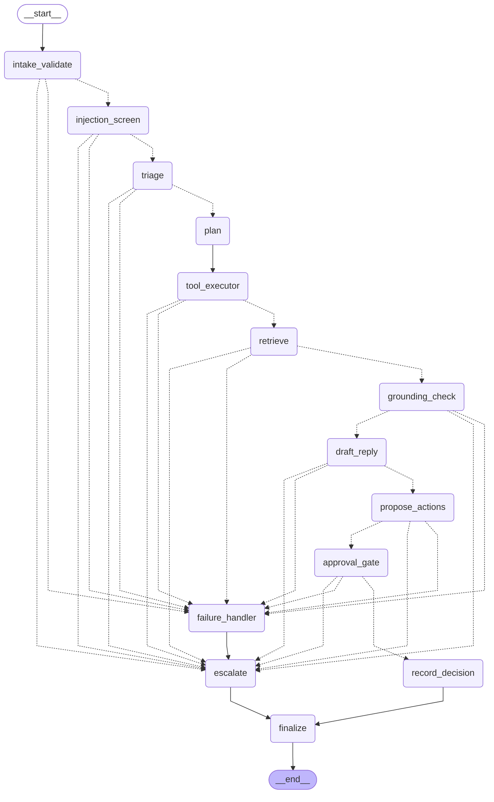

# Architecture — agent graph

Regenerate with `uv run python scripts/gen_diagram.py` (keep in sync with `app/agent/graph.py`).

```mermaid
---
config:
  flowchart:
    curve: linear
---
graph TD;
	__start__([<p>__start__</p>]):::first
	intake_validate(intake_validate)
	injection_screen(injection_screen)
	triage(triage)
	plan(plan)
	tool_executor(tool_executor)
	retrieve(retrieve)
	grounding_check(grounding_check)
	draft_reply(draft_reply)
	propose_actions(propose_actions)
	approval_gate(approval_gate)
	record_decision(record_decision)
	escalate(escalate)
	failure_handler(failure_handler)
	finalize(finalize)
	__end__([<p>__end__</p>]):::last
	__start__ --> intake_validate;
	approval_gate -.-> escalate;
	approval_gate -.-> failure_handler;
	approval_gate -.-> record_decision;
	draft_reply -.-> escalate;
	draft_reply -.-> failure_handler;
	draft_reply -.-> propose_actions;
	escalate --> finalize;
	failure_handler --> escalate;
	grounding_check -.-> draft_reply;
	grounding_check -.-> escalate;
	grounding_check -.-> failure_handler;
	injection_screen -.-> escalate;
	injection_screen -.-> failure_handler;
	injection_screen -.-> triage;
	intake_validate -.-> escalate;
	intake_validate -.-> failure_handler;
	intake_validate -.-> injection_screen;
	plan --> tool_executor;
	propose_actions -.-> approval_gate;
	propose_actions -.-> escalate;
	propose_actions -.-> failure_handler;
	record_decision --> finalize;
	retrieve -.-> escalate;
	retrieve -.-> failure_handler;
	retrieve -.-> grounding_check;
	tool_executor -.-> escalate;
	tool_executor -.-> failure_handler;
	tool_executor -.-> retrieve;
	triage -.-> escalate;
	triage -.-> failure_handler;
	triage -.-> plan;
	finalize --> __end__;
	classDef default fill:#f2f0ff,line-height:1.2
	classDef first fill-opacity:0
	classDef last fill:#bfb6fc
```
